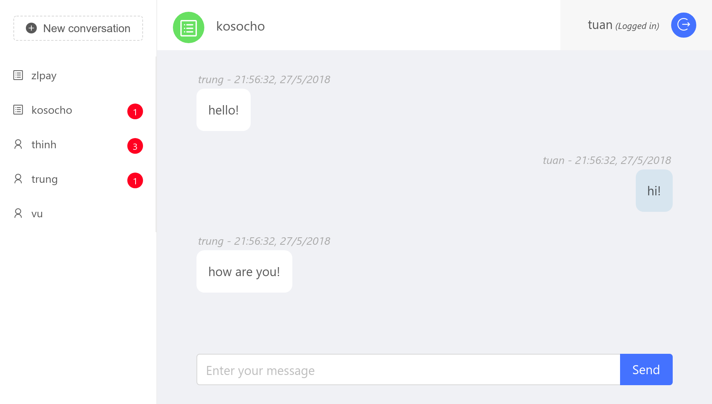

# Chatt

A React Web Application

## Techniques used

- **create-react-app**: For creating project.
- **superagent**: For ajax operations.
- **react-redux**: For managing react states.
- **antd**: Ant-Design.
- **WebSocket**.

## Screenshots

